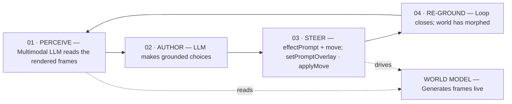
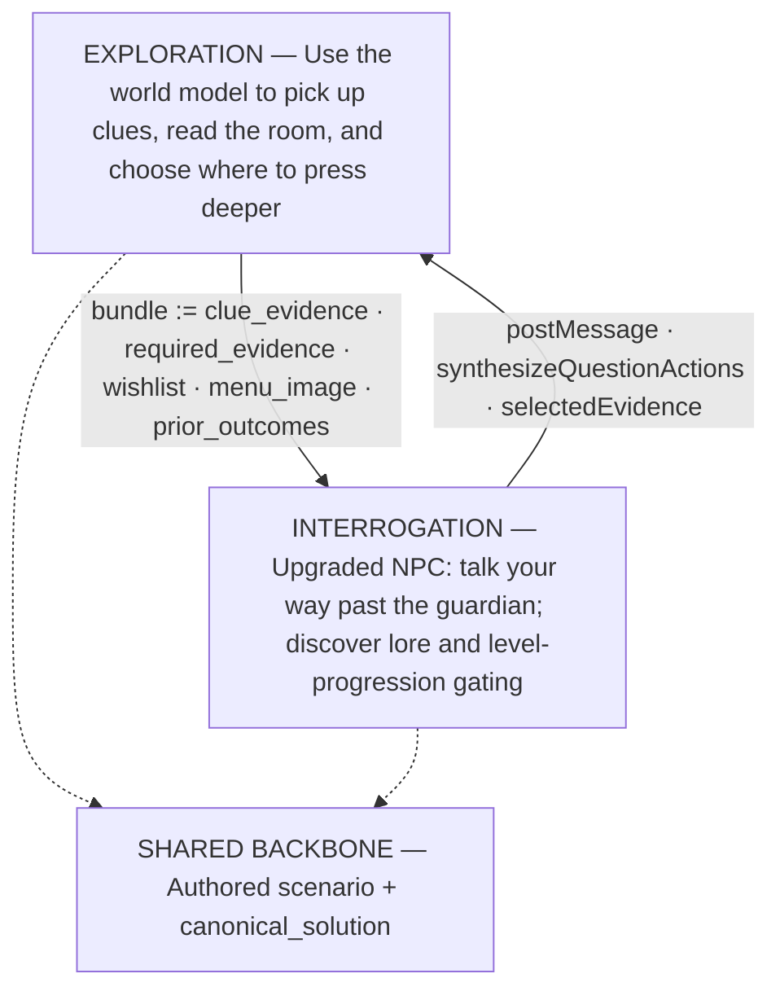

# Hugo Interactive Game

## Concept

Hugo is an interactive game built around a continuously rendered world model and an LLM-driven control loop. The system observes the current visual state, chooses a grounded action, applies that action to the world, and then observes the changed result. This keeps generated actions tied to what is actually visible rather than relying only on prior text context.

## Core Interaction Loop

The primary loop has four stages:

1. **Perceive:** A multimodal LLM reads the frames produced by the world model.
2. **Author:** An authoring LLM chooses actions grounded in the perceived state.
3. **Steer:** The selected prompt and move are applied to the running world.
4. **Re-ground:** The system closes the loop by observing the world after it has changed.

The world model runs alongside this loop. Perception reads from it, while steering drives its next generated state.

This loop makes the rendered world the source of truth. Every new choice is based on the current output, reducing drift between the authored narrative, player actions, and the visible game state.

## Exploration and Interrogation Modes

Hugo supports two complementary modes of play:

- **Exploration** uses the world model to find clues, read the environment, and decide where to investigate more deeply.
- **Interrogation** uses upgraded NPC interactions to let the player talk past guardians, uncover lore, and navigate level-progression gates.

Both modes depend on the same authored scenario and canonical solution. Evidence and player outcomes flow from exploration into interrogation, while interrogation can return new messages and selected evidence that influence further exploration.

The shared backbone keeps both modes consistent: exploration and interrogation may expose different interactions, but they operate against the same scenario logic, evidence requirements, and intended solution.

## Design Summary

Together, these systems create a grounded interactive narrative:

- The world model continuously produces the playable visual state.
- The multimodal perception loop anchors decisions to rendered evidence.
- The authoring and steering stages translate observations into world changes.
- Exploration and interrogation provide distinct ways to collect and use evidence.
- The authored scenario and canonical solution preserve narrative coherence across both modes.

> Transcription note: The screenshots' smallest handwritten identifiers were interpreted on a best-effort basis. `synthesizeQuestionActions` is the least certain label in the second diagram.
