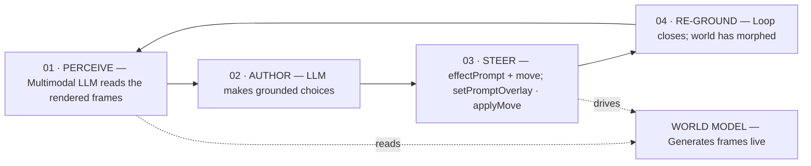
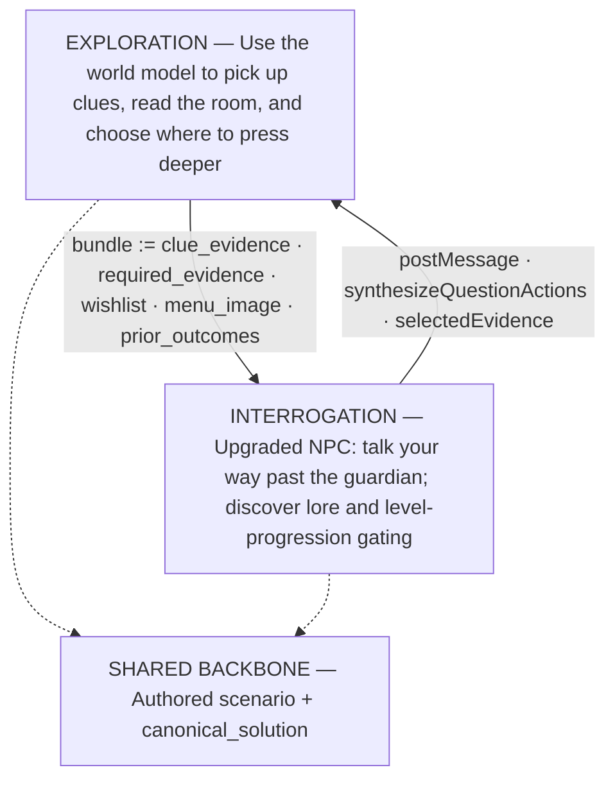

# Interactive Worlds Diagrams

## Perceive, Author, Steer, Re-ground

## Exploration and Interrogation

> The screenshots' smallest handwritten labels were transcribed on a best-effort basis. The least certain label is `synthesizeQuestionActions` in the second diagram.
